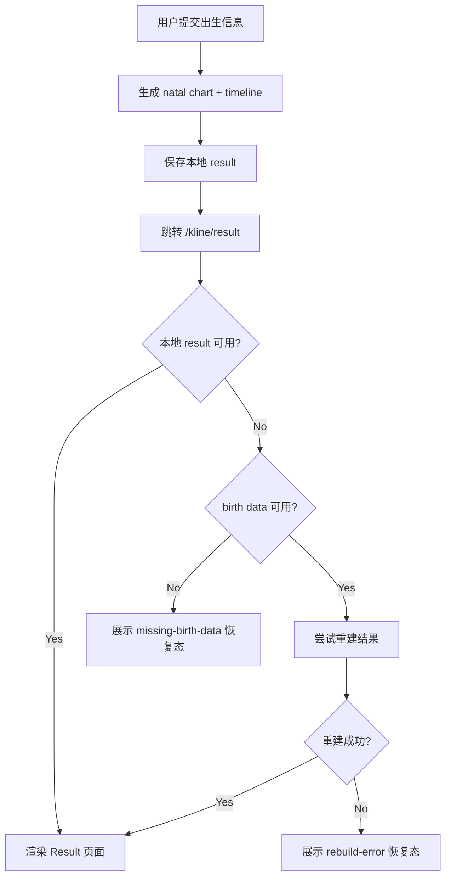
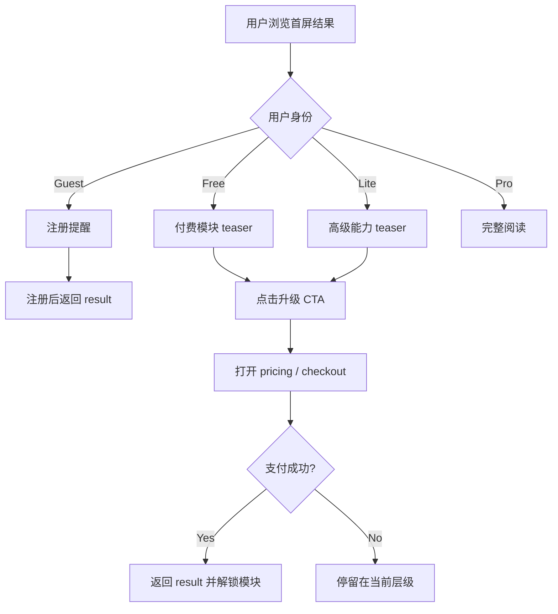
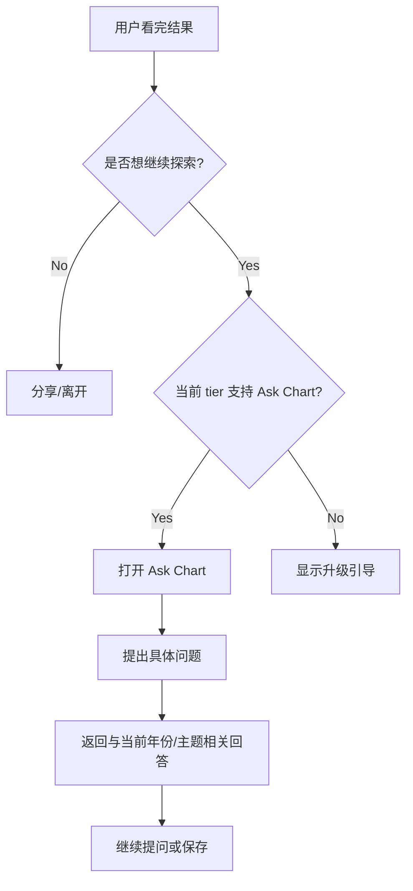

# AstroKline Result 页产品定义稿

## 1. 文档目标

本稿定义 AstroKline result 页的产品职责、信息架构、状态机、付费分层、交互流程与页面原型。

核心目标不是“展示一张图”，而是完成以下 5 件事：

1. 让用户在 10 秒内看懂自己当前所处的人生阶段。
2. 让用户立即相信这不是泛泛星座文案，而是基于个人出生数据的结构化结果。
3. 让免费用户明确看到“已获得什么”和“还差什么”。
4. 让付费用户获得足够强的纵深分析，形成留存与分享。
5. 让页面在丢失本地状态、刷新、登录切换、配额限制时仍可恢复或给出明确下一步。

## 2. 北极星定义

| 维度 | 定义 | 说明 |
| --- | --- | --- |
| 北极星指标 | Result 页到升级页点击率 | 判断结果页是否真正承担商业转化职责 |
| 第一成功指标 | Result 首屏 10 秒停留率 | 用户是否愿意继续往下看 |
| 第二成功指标 | Result 页分享率 | 说明结果是否具备自传播价值 |
| 第三成功指标 | 结果恢复成功率 | 刷新/回退后还能否回到结果页 |
| 第四成功指标 | Ask Chart 启动率 | 说明用户已把页面当成长期工具 |

## 3. 目标用户与页面任务

| 用户类型 | 到达方式 | 当下任务 | 页面必须完成的事 |
| --- | --- | --- | --- |
| Guest 新用户 | 生成后首次进入 | 判断值不值得注册/付费 | 给到震撼感、可信度、可理解的价值差异 |
| Free 已注册用户 | 已生成结果 | 判断是否升级 | 让“有限结果”和“完整结果”差异非常清晰 |
| Lite 用户 | 已付基础版 | 想看更深解释 | 给到结构化洞察，并暴露 Pro 的长期价值 |
| Pro 用户 | 已付高阶版 | 消化结果并反复使用 | 提供完整模块、提问入口、分享与下载 |
| 恢复态用户 | 刷新或跨设备进入 | 找回结果或重新生成 | 明确状态，不让用户迷路 |

## 4. 产品定位一句话

Result 页不是报告的末端，而是 AstroKline 的主控台。

它既要像“命运仪表盘”，又要像“升级前的价值演示页”，还要像“后续 Ask Chart 交互的起点”。

## 5. 页面分层模型

| 层级 | 名称 | 用户感知 | 产品职责 |
| --- | --- | --- | --- |
| L1 | 首屏判断层 | 我现在处在哪个阶段 | 用最短路径解释当前状态 |
| L2 | 证据层 | 为什么会这样 | 用曲线、关键年份、结构指标建立信任 |
| L3 | 行动层 | 我应该怎么做 | 把阶段转成行动建议 |
| L4 | 纵深层 | 更深的人格/事业/关系分析 | 支撑付费升级与长期使用 |
| L5 | 传播层 | 我能否分享/保存/继续探索 | 承接增长与复访 |

## 6. 页面模块定义

| 顺序 | 模块 | 是否首屏 | 面向谁 | 目标 | 必须输出 |
| --- | --- | --- | --- | --- | --- |
| 1 | Profile Ribbon | 是 | 全部用户 | 建立“这是我的图” | 姓名遮罩、太阳/月亮/上升、当前阶段 |
| 2 | Life Curve Hero | 是 | 全部用户 | 给出主图冲击力 | 10 年或 100 年曲线、当前点、峰值/低谷 |
| 3 | Destiny Summary | 是 | 全部用户 | 一句话解释当前周期 | 当前窗口、核心建议、风险等级 |
| 4 | Key Year Anchors | 否 | 全部用户 | 建立时间可信度 | 关键年份卡片、转折原因 |
| 5 | Dimension Radar | 否 | 全部用户 | 快速说明人生维度分布 | Career / Love / Wealth / Health |
| 6 | AI Reading Panels | 否 | Lite/Pro | 提供纵深解释 | 分维度段落、年度建议、触发词 |
| 7 | Next 30 Days | 否 | Lite/Pro | 把宏观趋势落到近期 | 本月节奏、注意事项、微行动 |
| 8 | Future Cliffhanger | 否 | Guest/Free/Lite | 制造升级张力 | 下一高峰或下一风险的局部预告 |
| 9 | Ask Chart Entry | 否 | Lite/Pro | 打开长期互动 | 提问入口、推荐问题 |
| 10 | Share / Download / Referral | 否 | 全部用户 | 增长与留存 | 分享、下载、邀请 |

## 7. 模块文案契约

| 模块 | 文案语气 | 禁止事项 | 合格标准 |
| --- | --- | --- | --- |
| 首屏结论 | 冷静、明确、带方向 | 玄学口号、空泛鼓励 | 用户 3 秒能知道自己在上升/承压/转换期 |
| AI 解读 | 具体、可执行 | 只讲性格不讲时机 | 每段都要落到时间窗口或行为建议 |
| 付费引导 | 直白、克制 | 夸张承诺、恐吓式付费 | 用户能看懂升级后多看到什么 |
| 恢复态 | 清晰、无责备 | “出错了请重试”式模糊提示 | 明确告诉用户该去哪里恢复 |

## 8. 分层与权限策略

| 能力 | Guest | Free | Lite | Pro |
| --- | --- | --- | --- | --- |
| 首屏曲线与摘要 | Yes | Yes | Yes | Yes |
| 完整 10 年时间轴 | Partial | Partial | Yes | Yes |
| AI 分维度解读 | Teaser | Teaser | Yes | Yes |
| Next 30 Days | No | No | Yes | Yes |
| Ask Chart | No | No | Limited | Full |
| 高级下载/PDF | No | No | Limited | Full |
| 分享卡片 | Yes | Yes | Yes | Yes |

## 9. 状态机定义

| 状态 | 触发条件 | 页面表现 | 下一步 |
| --- | --- | --- | --- |
| initializing | 刚进入 result 页 | Loader | 读取本地结果或远端恢复 |
| hydrated | 成功拿到结果 | 正常结果页 | 可浏览/升级/分享 |
| guest_nudge | Guest 停留或滚动到阈值 | 注册提醒 | 注册后返回 result |
| quota_blocked | 免费额度耗尽 | Quota 弹层 | 升级或稍后再试 |
| recovery_missing_birth | 没有 birth data | 恢复态页 | 回 generator 重新生成 |
| recovery_failed | 有 birth data 但重建失败 | 恢复态页 | 重新生成或进 dashboard |
| upgrade_modal | 点击升级 CTA | 定价弹层 | 去 pricing 或关闭 |

## 10. 核心流程图

### 10.1 结果生成与恢复流程



### 10.2 免费到付费转化流程



### 10.3 长期互动流程



## 11. 首屏信息架构

### 11.1 首屏必须回答的 5 个问题

| 问题 | 由谁回答 |
| --- | --- |
| 这是我的结果吗 | Profile Ribbon |
| 我现在整体是上升还是承压 | Destiny Summary |
| 未来几年怎么走 | Life Curve Hero |
| 为什么我该相信它 | Key signals + data badges |
| 我接下来做什么 | CTA + 微行动建议 |

### 11.2 首屏建议布局

1. 顶部面包屑和身份感极弱化，不抢夺主结论。
2. 第一视觉中心必须是曲线，不是段落文字。
3. 曲线旁必须有一段 2 到 3 句的当前周期说明。
4. 首屏底部必须出现一个明确 CTA：升级、提问、或继续查看关键年份。

## 12. ASCII 原型图

### 12.1 Desktop 原型

```text
+----------------------------------------------------------------------------------+
| Breadcrumb                                                                       |
+----------------------------------------------------------------------------------+
| [Profile Ribbon]  A***   Sun / Moon / Rising   Current Phase: Expansion          |
+----------------------------------------------------------------------------------+
|                           LIFE CURVE HERO                                         |
|  +--------------------------------------------------------------------------+    |
|  |                         curve / current year / peaks                      |    |
|  |                                                                          |    |
|  +--------------------------------------------------------------------------+    |
|  Summary: You are entering a strong 24-month window.                         |    |
|  CTA: [Unlock Full Reading] [See Key Years]                                  |    |
+----------------------------------------------------------------------------------+
| Key Year Anchors                                                                |
| [2025 Pivot] [2027 Peak] [2029 Pressure] [2031 Recovery]                       |
+----------------------------------------------------------------------------------+
| Dimension Radar            | AI Reading Preview                                |
| Career  Love  Wealth ...   | Career / Love / Wealth / Health                  |
+----------------------------------------------------------------------------------+
| Next 30 Days               | Future Cliffhanger                                |
| Micro guidance             | Next major opening hidden behind upgrade          |
+----------------------------------------------------------------------------------+
| Ask Chart Entry                                                                |
| Suggested prompts:                                                             |
| - What should I optimize in the next 6 months?                                |
| - Why is 2027 a peak year?                                                     |
+----------------------------------------------------------------------------------+
| Share | Download | Referral | Footer                                            |
+----------------------------------------------------------------------------------+
```

### 12.2 Mobile 原型

```text
+--------------------------------------+
| Breadcrumb                           |
+--------------------------------------+
| Profile Ribbon                       |
| A***  Sun/Moon/Rising                |
| Current Phase: Expansion             |
+--------------------------------------+
| LIFE CURVE HERO                      |
| [curve chart]                        |
| Strong window for next 24 months     |
| [Unlock Full Reading]                |
+--------------------------------------+
| Key Year Cards                       |
| [2025] [2027] [2029]                 |
+--------------------------------------+
| Destiny Summary                      |
| 3 short paragraphs                   |
+--------------------------------------+
| Dimension Radar                      |
+--------------------------------------+
| AI Reading Preview                   |
+--------------------------------------+
| Future Cliffhanger                   |
| Upgrade CTA                          |
+--------------------------------------+
| Ask Chart / Share / Download         |
+--------------------------------------+
```

## 13. 交互细节要求

| 交互点 | 要求 |
| --- | --- |
| 曲线 hover/click | 必须能定位到年份并联动下方阅读内容 |
| 年份卡点击 | 自动滚动到对应 insight 模块 |
| 升级 CTA | 任何位置点击后都要记录来源 source |
| 分享 | 默认分享不暴露完整隐私数据 |
| 恢复态按钮 | 一个主动作，一个次动作，不能让用户犹豫 |

## 14. 埋点建议

| 事件名 | 触发时机 | 用途 |
| --- | --- | --- |
| result_loaded | result 页 hydrate 成功 | 看恢复链路健康度 |
| result_recovery_failed | 重建失败 | 看恢复问题 |
| result_upgrade_cta_click | 任意升级入口点击 | 看转化漏斗 |
| result_share_click | 分享点击 | 看传播价值 |
| result_ask_chart_open | 打开 Ask Chart | 看长期互动价值 |
| result_key_year_click | 点击关键年份 | 看用户关注点 |

## 15. 非目标

以下内容不应成为 result 页主任务：

1. 解释全部占星术基础知识。
2. 承担完整 onboarding 表单职责。
3. 用超长文章取代结构化结果。
4. 让免费用户在没有明确边界的情况下白嫖完整价值。

## 16. 推荐实施顺序

| 阶段 | 目标 | 产出 |
| --- | --- | --- |
| Phase 1 | 首屏与恢复态打磨 | 完成 hydration, recovery, summary, hero |
| Phase 2 | 关键年份与维度结构 | 完成 anchors, radar, teaser logic |
| Phase 3 | Ask Chart 与分享增强 | 完成长期互动与传播层 |
| Phase 4 | A/B 测试与定价导流优化 | 优化 upgrade CTR 和 retention |

## 17. 一句话验收标准

如果一个新用户打开 result 页后，能在 10 秒内回答“我现在在什么阶段、为什么、下一步该做什么、升级后还能看到什么”，这页就算达标。
